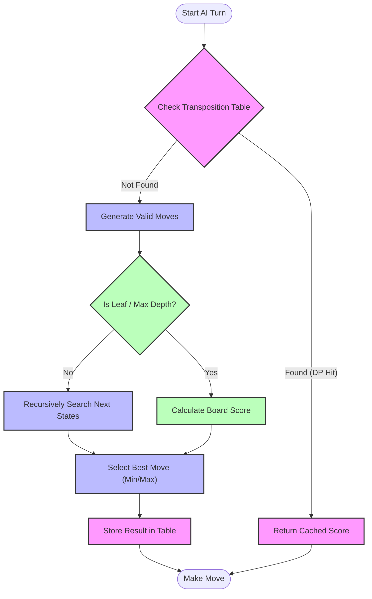

# Othello - DAA Project

A Python implementation of the classic board game **Othello (Reversi)**

## Features

*   **Game Modes:** 1 Player (vs AI) and 2 Players (PvP).
*   **Algorithms:** Minimax and Greedy .
*   **Visualization:** Real-time AI search tree view, heatmaps.
*   **Interfaces:** Modern Graphical UI and classical Terminal UI.

## Requirements

*   Python 3.x
*   `pygame`

## Installation

1.  **Clone the repository** (if applicable) or navigate to the project directory.

2.  **Set up a Virtual Environment (Recommended):**
    ```bash
    python3 -m venv venv
    source venv/bin/activate  # On Windows: venv\Scripts\activate
    ```

3.  **Install Dependencies:**
    ```bash
    pip install pygame
    ```

## How to Run

### Graphical Version (Recommended)
Calculates layout dynamically based on window size.

```bash
python main_pygame.py
```

**Controls:**
*   **Click:** Select Game Mode / Grid Size / Make Move
*   **'A' Key:** Toggle Algorithm Visualization (On/Off)
*   **'H' Key:** Toggle Heatmap Overlay (On/Off)
*   **'F' Key:** Toggle Fullscreen

### Terminal Version
Simple text-based interface.

```bash
python main_terminal.py
```

## Project Structure

*   `main_pygame.py`: Entry point for the GUI game.
*   `main_terminal.py`: Entry point for the CLI game.
*   `algorithms/`:
    *   `graph.py`: Search Algorithms (Minimax, Alpha-Beta) and visualization generators.
    *   `greedy.py`: Greedy strategy logic.
    *   `heuristics.py`: Board evaluation weights.
*   `model/`:
    *   `board.py`: Core game logic.
    *   `game_state.py`: State representation.
*   `ui/`:
    *   `pygame_gui.py`: Main GUI logic.
    *   `terminal.py`: Terminal UI logic.
    *   `pygame_dnc.py`: Advanced GUI with Divide & Conquer and DP visualization.

## Advanced Visualization (DP & Divide-and-Conquer)

To see the AI's thought process with **Dynamic Programming** and **Divide & Conquer** visualization:

```bash
python pygame_dnc.py
```

**New Controls:**
*   **'D' Key:** Toggle **DP Mode** (Dynamic Programming).
*   **'H' Key:** Toggle **Algo View** (Visualize the search tree).
*   **'E' Key:** Toggle Evaluation Bar.
*   **'M' Key:** Toggle Heatmap.

### AI Strategy Breakdown
Our AI combines three powerful concepts to solve Othello efficiently.



1.  **Divide & Conquer (Blue):** We break the complex board state into smaller sub-problems (future moves) and solve them.
2.  **Dynamic Programming (Pink):** We use a **Transposition Table** to remember board states we've already solved. If we encounter the same state again (via a different move order), we skip the work!
    *   *Visualization:* Look for "DP HIT!" in the side panel.
3.  **Heuristics (Green):** When we can't search to the end, we estimate the board value using positional weights (corners are good, X-squares are bad).

