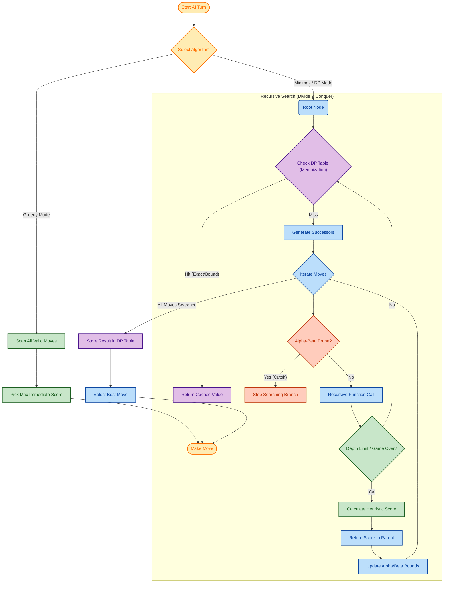
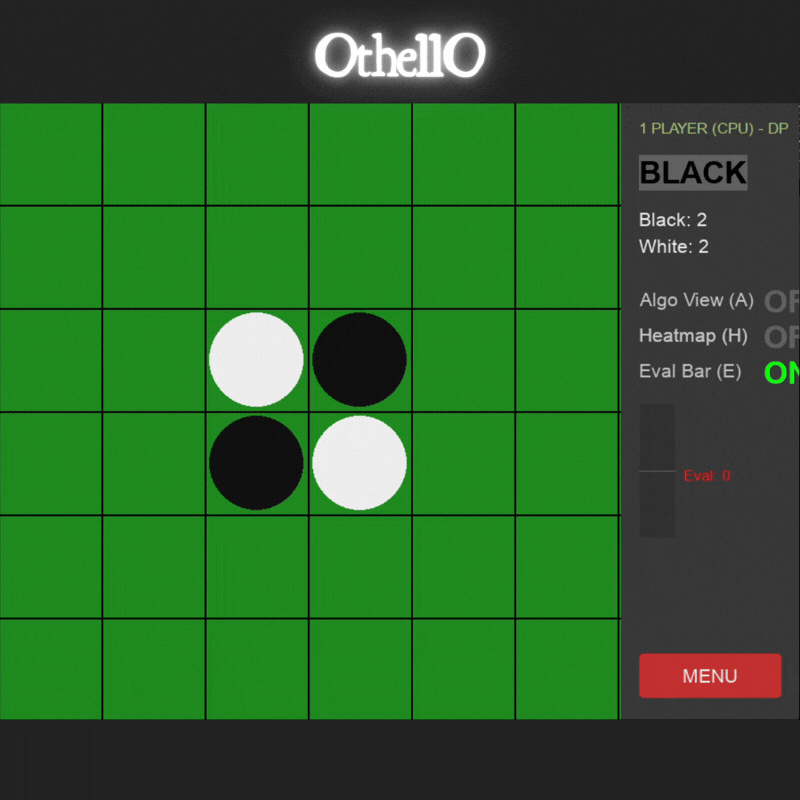

# Othello - DAA Project

A Python implementation of the classic board game **Othello (Reversi)**

## 🎮 Play in your browser

**[▶ Play now](https://nimaldanyathk.github.io/Othello_DAA_Project/)** — no installation needed.

The game runs directly in the browser via [pygbag](https://pypi.org/project/pygbag/) (Python compiled to WebAssembly). The first load downloads the Python runtime (~15 MB), so give it a few seconds, then click once to start.

## Features

*   **Game Modes:** 1 Player (vs AI) and 2 Players (PvP).
*   **Algorithms:** Minimax and Greedy .
*   **Visualization:** Real-time AI search tree view, heatmaps.
*   **Interfaces:** Modern Graphical UI and classical Terminal UI.

## Requirements

*   Python 3.x
*   `pygame`

## Installation

1.  **Clone the repository** (if applicable) or navigate to the project directory.

2.  **Set up a Virtual Environment (Recommended):**
    ```bash
    python3 -m venv venv
    source venv/bin/activate  # On Windows: venv\Scripts\activate
    ```

3.  **Install Dependencies:**
    ```bash
    pip install pygame
    ```

## How to Run

### Graphical Version (Recommended)
Calculates layout dynamically based on window size.

```bash
python main_pygame.py
```

**Controls:**
*   **Click:** Select Game Mode / Grid Size / Make Move
*   **'A' Key:** Toggle Algorithm Visualization (On/Off)
*   **'H' Key:** Toggle Heatmap Overlay (On/Off)
*   **'F' Key:** Toggle Fullscreen

### Terminal Version
Simple text-based interface.

```bash
python main_terminal.py
```

### Web Version (rebuild)
The playable browser build lives in `docs/` and is served by GitHub Pages. To rebuild it after changing the code:

```bash
pip install pygbag
python -m pygbag --build --title "Othello - DAA Project" main.py
```

Then replace the contents of `docs/` with `build/web/` and push. Note: `main.py` is the web entry point; when testing a build locally, open it via `http://127.0.0.1:<port>` (not `localhost`, which triggers pygbag's dev-server mode).

## Project Structure

*   `main_pygame.py`: Entry point for the GUI game.
*   `main_terminal.py`: Entry point for the CLI game.
*   `algorithms/`:
    *   `graph.py`: Search Algorithms (Minimax, Alpha-Beta) and visualization generators.
    *   `dp.py`:Optimized Minimax with Memoization (Dynamic Programming).
    *   `divide_and_conquer.py`:Pure Divide & Conquer implementation (Minimax Generator).
    *   `greedy.py`: Greedy strategy logic.
    *   `backtracking.py`: In-place Minimax search with backtracking.
    *   `heuristics.py`: Board evaluation weights.
*   `model/`:
    *   `board.py`: Core game logic.
    *   `game_state.py`: State representation.
*   `ui/`:
    *   `pygame_gui.py`: Main GUI logic.
    *   `terminal.py`: Terminal UI logic.
    *   `pygame_dnc.py`: Advanced GUI with Divide & Conquer and DP visualization.

## Advanced Visualization (DP & Divide-and-Conquer)

To see the AI's thought process with **Dynamic Programming** and **Divide & Conquer** visualization:

```bash
python pygame_dnc.py
```

**New Controls:**
*   **'D' Key:** Toggle **DP Mode** (Dynamic Programming).
*   **'H' Key:** Toggle **Algo View** (Visualize the search tree).
*   **'E' Key:** Toggle Evaluation Bar.
*   **'M' Key:** Toggle Heatmap.

### AI Strategy Breakdown
Our AI combines three powerful concepts to solve Othello efficiently.


```mermaid
flowchart TD
    %% Custom Styling
    classDef memory fill:#e1bee7,stroke:#4a148c,stroke-width:2px,color:#4a148c;
    classDef logic fill:#bbdefb,stroke:#0d47a1,stroke-width:2px,color:#0d47a1;
    classDef eval fill:#c8e6c9,stroke:#1b5e20,stroke-width:2px,color:#1b5e20;
    classDef prune fill:#ffccbc,stroke:#bf360c,stroke-width:2px,color:#bf360c;
    classDef start fill:#ffecb3,stroke:#ff6f00,stroke-width:2px,color:#ff6f00;

    Start([Start AI Turn]):::start --> Mode{"Select Algorithm"}:::start
    
    %% Greedy Algo
    Mode -- "Greedy Mode" --> G_Scan[Scan All Valid Moves]:::eval
    G_Scan --> G_Pick[Pick Max Immediate Score]:::eval
    G_Pick --> End([Make Move]):::start

    %% Minimax Algo
    Mode -- "Minimax / DP Mode" --> Root(Root Node):::logic
    
    subgraph "Recursive Search (Divide & Conquer)"
        Root --> TP_Check{"Check DP Table (Memoization)"}:::memory
        
        TP_Check -- "Hit (Exact/Bound)" --> TP_Ret[Return Cached Value]:::memory
        TP_Ret -.-> End
        
        TP_Check -- "Miss" --> Gen[Generate Successors]:::logic
        Gen --> Loop{"Iterate Moves"}:::logic
        
        Loop --> AB_Check{"Alpha-Beta Prune?"}:::prune
        AB_Check -- "Yes (Cutoff)" --> Prune[Stop Searching Branch]:::prune
        
        AB_Check -- "No" --> Recurse[Recursive Function Call]:::logic
        Recurse --> Leaf{"Depth Limit / Game Over?"}:::eval
        
        Leaf -- "Yes" --> Heur[Calculate Heuristic Score]:::eval
        Leaf -- "No" --> TP_Check
        
        Heur --> Backprop[Return Score to Parent]:::logic
        Backprop --> UpdateAB[Update Alpha/Beta Bounds]:::logic
        UpdateAB --> Loop
    end
    
    Loop -- "All Moves Searched" --> Store[Store Result in DP Table]:::memory
    Store --> Best[Select Best Move]:::logic
    Best --> End
```

1.  **Divide & Conquer (Blue):** We break the complex board state into smaller sub-problems.
2.  **Dynamic Programming (Purple):** We use a **Transposition Table** to remember board states. If we encounter the same state again (via a different move order), we skip the work!
    *   *Visualization:* Look for "DP HIT!" in the side panel.
3.  **Heuristics (Green):** When we can't search to the end, we estimate based on corners and mobility.
4.  **Alpha-Beta Pruning (Orange):** We stop searching branches that are obviously worse than what we've already found.

***

<div align="center">
  
</div>

